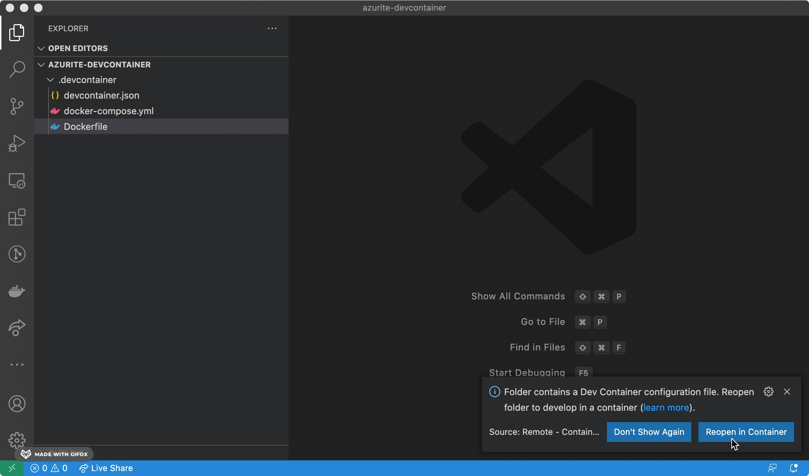

# Supported Developement Environments
Developers are encouraged to use docker where possible to cultivate project consistency. Development related configuration files are stored in ```dev/ide/``` and moved to the application's root directory when build or installation scripts are run. Development configuration files generated by an IDE are generally added to the ```.gitignore``` file.
Share workspace settings with team members by carefully adding to the files under ```dev/ide/```

## Visual Studio Code (VSCode)
Running ```python dev/build.py``` should move preconfiguration files into the root directory of the application.  
* ```.vscode``` launch files, extensions, workspace settings.
* ```.devcontainer``` contains generated files to provision a docker container for use as a development environment.

#### Developing inside of a container
* Run ```python dev/install.py``` from the applicaiton's root.
* Start VSCode and open application directory as the workspace
* VSCode will detect ```.devcontainer``` in the root directory of the workspace and promt the user to relaunch workspace as a container.
* Alternatively, a container relaunch can be triggered by pressing F1 and typing in the command palette ```> Remote-Containers: Open Workspace in Container```



* VSCode will restart and run a series of scripts to prepare a developement environment using the docker image built with ```python dev/install.py```
  * Files inside of ```.devcontainer``` are updated.
  * Mount points are established.
  * Extensions are installed and configured.
  * The docker compose file is overriden with a new command which keeps the container from closing after the appication has been terminated.
* Docker is installed inside of this devlopment container. This permits developers to adopt the same workflow inside or outside of the development container. ```python dev/install.py``` will launch a docker swarm while ```python dev/build.py``` will rebuild the application and update a service in the docker stack.
* Press F5 to run the application in a debugger using the settings inside of ```./vscode/launch.json```
* Press F1 to open the command palette then tigger a formatting update by typing ```> Format Document``` The IDE should come preconfigured with the extensions and settings necessary to auto-format most source code.